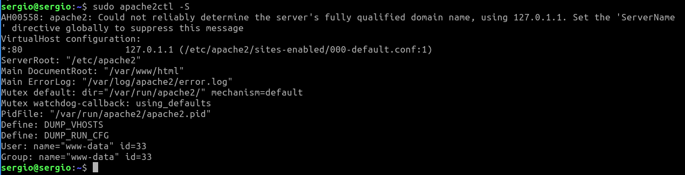

# Tarea 05 · Despliegue de Aplicaciones Web
___
## Oliver Fabian Stetcu Stepanov
___
## Tarea HTTP · 
___
## Servidor web Apache 2
___

* https://despliegue.codeandcoke.com/apuntes:servidores_web
* http://jamj2000.github.io/despliegueaplicacionesweb/2/diapositivas#/2
* https://despliegue.abrilcode.com/doku.php?id=bloque3:web
* https://plataforma.josedomingo.org/pledin/cursos/apache24/index.html

## 1.- Infraestructura

Reutilizaremos las MV de la práctica de ``ssh``. Dos MV dentro de una ``red NAT``:
* **Servidor**: con un Ubuntu server sin entorno gráfico.
    * Usuario: ``sergio``, contraseña: ``sergio``.
* **Casa**: con un Lubuntu con el entorno gráfico por defecto (LXQt).
    * Usuario: ``carmen``, contraseña: ``carmen``.

Desde el equipo **Casa** nos conectaremos al equipo **Servidor** mediante una conexión ``ssh`` autentificándonos mediante claves asimétricas ``ed25519``.

## Instalación y uso básico

1. Acceder al servidor:

Desde el equipo de **Casa** ejecutamos el siguiente comando:

```bash
ls -la .ssh
cd ~/.ssh
ssh -p 22 -i clave_trabajo sergio@10.0.2.8

o

ssh -p 22 sergio@10.0.2.8
```

En mi caso he borrado la MV de **Casa** y la he vuelto a instalar, por lo que no tengo la clave generada en la **Tarea 01**. La nueva IP de **Casa** es **10.0.2.10**, en vez de **10.0.2.9**, que era la anterior.

Resultado:


> Casi toda la instalación y configuración la debemos hacer con privilegios de administrador podemos ejecutar ``sudo`` en todas las instrucciones o cambiar al usuario administrador ``sudo su``.

2. Instalar Apache y ver su versión:

```bash
sudo apt update
sudo apt install apache2 -y
apache2 -v
```

Resultado:


> La instalación crea el usuario ``www-data`` que ejecuta el servicio denominado ``apache2``. Puedes comprobar el usuario mostrando el contenido del archivo ``cat /etc/passwd | grep wwwdata`` y ver el proceso en ejecución con: ``ps -aux | grep www-data``

3. Comprobar estado del servicio ``apache2``:

```bash
sudo systemctl status apache2
```

Resultado:


4. Con los siguientes comandos lo activaremos para que se inicie al arrancar el servidor y lo iniciaremos:

```bash
sudo systemctl enable apache2
sudo systemctl start apache2
```

Resultado:


> Otras comandos del servicio son: ``sudo systemctl [enable|start|restart|status|reload|show|disable] apache2``

5. Apache trae un funcionalidad para gestionar el servicio: ``apache2ctl``.

```bash
apache2ctl [-k start|restart|graceful|graceful-stop|stop]
```

Por ejemplo:

```bash
sudo apache2ctl -S
sudo apache2ctl -M
sudo apache2ctl -V
```

Esta herramienta también nos ofrece información del servidor:

* ``apache2ctl -t`` : Comprueba la sintaxis del fichero de configuración.
* ``apache2ctl -M`` : Lista los módulos cargados.
* ``apache2ctl -S`` : Lista los sitios virtuales y las opciones de configuración.
* ``apache2ctl -V`` : Lista las opciones de compilación

Resultado:





6. Reglas firewall:

```bash
sudo ufw enable
sudo ufw allow Apache
sudo ufw status verbose

o

sudo ufw allow 80/tcp
```

Resultado:


7. Probar desde el cliente qué puertos tiene abiertos el servidor, en nuestro ejemplo desde el equipo **Casa** ejecutaremos:

```bash
exit
sudo apt install nmap
nmap 10.0.2.8 -p 1-1024
```

Resultado:


> Por defecto el servicio HTTP utiliza el puerto 80.

> Si no tienes instalada esta utilidad, instalalá con: ``sudo apt install nmap``. Esta comprobación también se puede hacer desde el propio servidor, pero es menos fiable que desde otro equipo ya que puede conectarse por la interfaz de loopback.

8. Comprobar en el equipo **Servidor** qué conexiones tiene abiertas:

```bash
ssh -p 22 sergio@10.0.2.8
sudo ss -natu
o
sudo ss -natup | grep apache2
```

Resultado:


## 3.- Archivos de configuración

1. Los archivos de configuración de ``apache2`` se encuentran en la carpeta ``/etc/apache2/``.

Muestra con la instrucción tree la estructura de archivos del directorio ``/etc/apache2/``.

```bash
sudo apt install tree
tree /etc/apache2/
```

Resultado:


2. Algunas configuraciones de ejemplo del archivo ``/etc/apache2/apache2.conf``:

Muestra la configuración por defecto de este archivo.

```bash
cat /etc/apache2/apache2.conf

o

nano /etc/apache2/apache2.conf
```

Resultado:


3. Algunas configuraciones de ejemplo del archivo ``/etc/apache2/port.conf``:

Muestra la configuración por defecto de este archivo.

```bash
cat /etc/apache2/ports.conf

o

nano /etc/apache2/ports.conf
```

Resultado:


4. Algunas configuraciones de ejemplo de un archivo de host virtual: ``/etc/apache2/sitesavailable/000-default.conf``:

Muestra la configuración por defecto de este archivo.

```bash
cat /etc/apache2/sites-available/000-default.conf

o

nano /etc/apache2/sites-available/000-default.conf
```

Resultado:


> También podemos crear hosts virtuales asociados a un puerto diferente, de modo que si indicamos diferentes puertos nos permite acceder a diferentes sitios, por ejemplo: ``<VirtualHost *:8080>, <VirtualHost *:8081>``, ... Previamente estos puertos deben estar a la escucha configurados en el archivo ``/etc/apache2/ports.conf``:

> Los ficheros de hosts virtuales se cargan en orden alfabético (por su nombre de fichero). Siempre que accedamos a nuestro servidor a través la IP, se mostrará el contenido del primer virtual host cargado. Recordemos que cuando accedemos al servidor por un nombre que no coincide con ningún virtual host, o mediante la IP, se mostrará el contenido del primer Virtual Host cargado (alfabéticamente).

## 4.- Verificar archivos de configuración

1. Podemos comprobar los archivos de configuración de apache2 con el comando:

```bash
sudo apt install links
apache2ctl configtest
apache2ctl status
```

> Este comando muestra los resultados en un navegador de línea de comandos. Si no tienes ninguno instalado, instala el navegador ``links``.

Resultado:


## 5.- Configurar host virtuales


