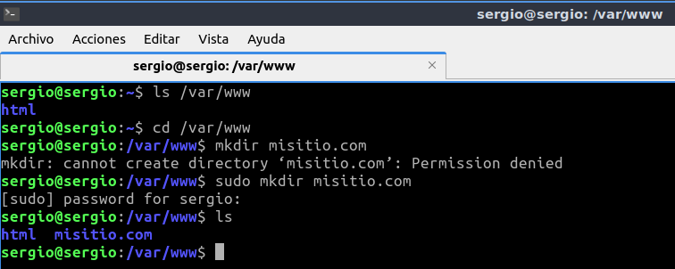
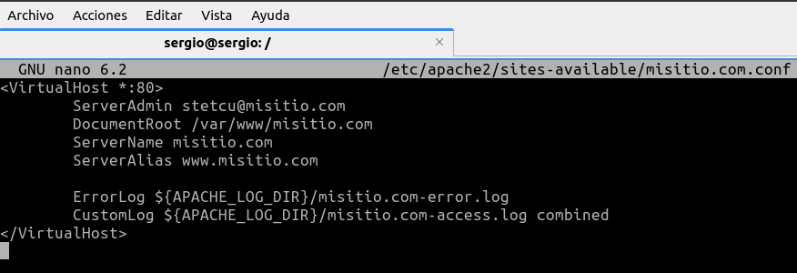
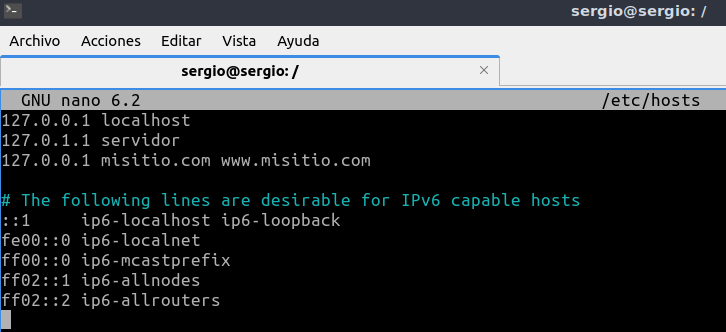
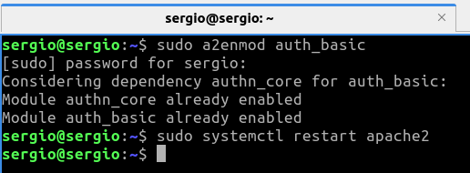
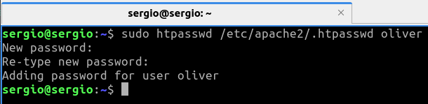

# Tarea 05 · Despliegue de Aplicaciones Web
___
## Oliver Fabian Stetcu Stepanov
___
## Tarea HTTP · 
___
## Servidor web Apache 2
___

* https://despliegue.codeandcoke.com/apuntes:servidores_web
* http://jamj2000.github.io/despliegueaplicacionesweb/2/diapositivas#/2
* https://despliegue.abrilcode.com/doku.php?id=bloque3:web
* https://plataforma.josedomingo.org/pledin/cursos/apache24/index.html

## 1.- Infraestructura

Reutilizaremos las MV de la práctica de ``ssh``. Dos MV dentro de una ``red NAT``:
* **Servidor**: con un Ubuntu server sin entorno gráfico.
    * Usuario: ``sergio``, contraseña: ``sergio``.
* **Casa**: con un Lubuntu con el entorno gráfico por defecto (LXQt).
    * Usuario: ``carmen``, contraseña: ``carmen``.

Desde el equipo **Casa** nos conectaremos al equipo **Servidor** mediante una conexión ``ssh`` autentificándonos mediante claves asimétricas ``ed25519``.

## Instalación y uso básico

1. Acceder al servidor:

Desde el equipo de **Casa** ejecutamos el siguiente comando:

```bash
ls -la .ssh
cd ~/.ssh
ssh -p 22 -i clave_trabajo sergio@10.0.2.8

o

ssh -p 22 sergio@10.0.2.8
```

En mi caso he borrado la MV de **Casa** y la he vuelto a instalar, por lo que no tengo la clave generada en la **Tarea 01**. La nueva IP de **Casa** es **10.0.2.10**, en vez de **10.0.2.9**, que era la anterior.

Resultado:


> Casi toda la instalación y configuración la debemos hacer con privilegios de administrador podemos ejecutar ``sudo`` en todas las instrucciones o cambiar al usuario administrador ``sudo su``.

2. Instalar Apache y ver su versión:

```bash
sudo apt update
sudo apt install apache2 -y
apache2 -v
```

Resultado:


> La instalación crea el usuario ``www-data`` que ejecuta el servicio denominado ``apache2``. Puedes comprobar el usuario mostrando el contenido del archivo ``cat /etc/passwd | grep wwwdata`` y ver el proceso en ejecución con: ``ps -aux | grep www-data``

3. Comprobar estado del servicio ``apache2``:

```bash
sudo systemctl status apache2
```

Resultado:


4. Con los siguientes comandos lo activaremos para que se inicie al arrancar el servidor y lo iniciaremos:

```bash
sudo systemctl enable apache2
sudo systemctl start apache2
```

Resultado:


> Otras comandos del servicio son: ``sudo systemctl [enable|start|restart|status|reload|show|disable] apache2``

5. Apache trae un funcionalidad para gestionar el servicio: ``apache2ctl``.

```bash
apache2ctl [-k start|restart|graceful|graceful-stop|stop]
```

Por ejemplo:

```bash
sudo apache2ctl -S
sudo apache2ctl -M
sudo apache2ctl -V
```

Esta herramienta también nos ofrece información del servidor:

* ``apache2ctl -t`` : Comprueba la sintaxis del fichero de configuración.
* ``apache2ctl -M`` : Lista los módulos cargados.
* ``apache2ctl -S`` : Lista los sitios virtuales y las opciones de configuración.
* ``apache2ctl -V`` : Lista las opciones de compilación

Resultado:


6. Reglas firewall:

```bash
sudo ufw enable
sudo ufw allow Apache
sudo ufw status verbose

o

sudo ufw allow 80/tcp
```

Resultado:


7. Probar desde el cliente qué puertos tiene abiertos el servidor, en nuestro ejemplo desde el equipo **Casa** ejecutaremos:

```bash
exit
sudo apt install nmap
nmap 10.0.2.8 -p 1-1024
```

Resultado:


> Por defecto el servicio HTTP utiliza el puerto 80.

> Si no tienes instalada esta utilidad, instalalá con: ``sudo apt install nmap``. Esta comprobación también se puede hacer desde el propio servidor, pero es menos fiable que desde otro equipo ya que puede conectarse por la interfaz de loopback.

8. Comprobar en el equipo **Servidor** qué conexiones tiene abiertas:

```bash
ssh -p 22 sergio@10.0.2.8
sudo ss -natu
o
sudo ss -natup | grep apache2
```

Resultado:


## 3.- Archivos de configuración

1. Los archivos de configuración de ``apache2`` se encuentran en la carpeta ``/etc/apache2/``.

Muestra con la instrucción tree la estructura de archivos del directorio ``/etc/apache2/``.

```bash
sudo apt install tree
tree /etc/apache2/
```

Resultado:


2. Algunas configuraciones de ejemplo del archivo ``/etc/apache2/apache2.conf``:

Muestra la configuración por defecto de este archivo.

```bash
cat /etc/apache2/apache2.conf

o

nano /etc/apache2/apache2.conf
```

Resultado:


3. Algunas configuraciones de ejemplo del archivo ``/etc/apache2/port.conf``:

Muestra la configuración por defecto de este archivo.

```bash
cat /etc/apache2/ports.conf

o

nano /etc/apache2/ports.conf
```

Resultado:


4. Algunas configuraciones de ejemplo de un archivo de host virtual: ``/etc/apache2/sitesavailable/000-default.conf``:

Muestra la configuración por defecto de este archivo.

```bash
cat /etc/apache2/sites-available/000-default.conf

o

nano /etc/apache2/sites-available/000-default.conf
```

Resultado:


> También podemos crear hosts virtuales asociados a un puerto diferente, de modo que si indicamos diferentes puertos nos permite acceder a diferentes sitios, por ejemplo: ``<VirtualHost *:8080>, <VirtualHost *:8081>``, ... Previamente estos puertos deben estar a la escucha configurados en el archivo ``/etc/apache2/ports.conf``:

> Los ficheros de hosts virtuales se cargan en orden alfabético (por su nombre de fichero). Siempre que accedamos a nuestro servidor a través la IP, se mostrará el contenido del primer virtual host cargado. Recordemos que cuando accedemos al servidor por un nombre que no coincide con ningún virtual host, o mediante la IP, se mostrará el contenido del primer Virtual Host cargado (alfabéticamente).

## 4.- Verificar archivos de configuración

1. Podemos comprobar los archivos de configuración de apache2 con el comando:

```bash
sudo apt install links
apache2ctl configtest
apache2ctl status
```

> Este comando muestra los resultados en un navegador de línea de comandos. Si no tienes ninguno instalado, instala el navegador ``links``.

Resultado:


## 5.- Configurar host virtuales

1. El hosting compartido consiste en el mantenimiento de diferentes sitios web (independientes entre ellos) en el mismo servidor, compartiendo recursos.

Por defecto ``apache2`` crea un sitio web en ``/var/www/html`` formado por un único archivo:
``index.html``. Este sitio está configurado en ``/etc/apache2/sites-available/000-default.conf``. Puedes usar este archivo de configuración de plantilla para configurar otros sitios web.

```bash
ls /var/www/html
cat /var/www/html/index.html
```

En una tarea anterior hemos creado un "**index.html**", podemos visualizarla.


```bash
cat /etc/apache2/sites-available/000-default.conf
```

Podemos ver el archivo de configuración para configurar otros sitios web:


Para crear otro sitio web, por ejemplo: ``www.misitio.com``, debes crear una carpeta hermana a
``html``, por ejemplo: ``/var/www/misitio.com``. Cada sitio web debe tener un archivo de configuración, siguiendo con el ejemplo anterior esta podría ser: ``/etc/apache2/sites-available/misitio.com.conf``. Puedes usar la plantilla ``/etc/apache2/sitesavailable/000-default.conf`` para no empezar desde cero. En nuestro ejemplo nuestro archivo
de configuración podría contener la siguiente configuración:

Vamos a crear una carpeta hermana a "**html**" de la siguiente manera:

```bash
ls /var/www
cd /var/www
sudo mkdir misitio.com
ls
```



```bash
ls /etc/apache2/
ls /etc/apache2/sites-available
cd /etc/apache2/sites-available
sudo touch misitio.com.conf
ls
```


Ahora configuro el archivo de configuración:

```bash
sudo nano misitio.com.conf
```



Si intentamos guardar nos va a salir este error de permisos (esto me pasa por no poner el ``sudo``):


> Recuerda que los ficheros servidos deben ser propiedad del usuario y grupo que usa Apache, es decir usuario ``www-data`` y grupo ``www-data``.

Configura el host ``virtual misitio.com`` según la información anterior.

Le concedo los permisos y guardo el archivo creado.

```bash
sudo chown -R www-data:www-data /var/www/misitio.com
sudo nano misitio.com.conf
```


2. Cuando hayamos terminado el archivo de configuración del nuevo host virtual, podemos activarlo
utilizando el comando ``a2ensite`` **(apache2 enable site)**:

```bash
sudo a2ensite misitio.com.conf
systemctl reload apache2
```

> Es lo mismo que hacer el enlace simbólico a mano:
>
> ```bash
> sudo ln -s ../sites-avaiable/misitio.com.conf /etc/apache2/sitesenabled/misitio.com.conf
> ```

> Para desactivar el sitio web usaremos el comando ``a2dissite`` **(apache2 disable site)**.


Automáticamente se creará un enlace simbólico con la configuración del sitio web de ``sites-available`` en ``sites-enabled``:

```bash
cd ..
ls sites-available
ls sites-enabled
```


3. Reiniciamos el servicio ``apache2``. Lo he reiniciado anteriormente, pero lo volveré a hacer por si acaso es necesario.

```bash
sudo systemctl restart apache2
sudo systemctl status apache2
```


4. Por simplicidad y para no tener que configurar un **servidor DNS** para indicarle a nuestro ordenador que el dominio ``misitio.com`` apunta a la dirección IP de nuestro servidor. Editaremos el archivo ``/etc/hosts`` que hace las funciones de DNS local:

```bash
sudo nano /etc/hosts
```



Si queremos probar desde el equipo **Casa** deberemos editar dicho archivo en ese equipo pero
indicándo la dirección IP de **Servidor**:

```bash
sudo nano /etc/hosts
```


> En Windows este fichero se encuentra en: ``C:\Windows\System32\Drivers\etc\hosts``.

En ambos casos podemos comprobar que resuelve el nombre con:

```bash
ping -c 3 misitio.com
y
ping -c 3 www.misitio.com
```


Y podemos ver la web con el navegador de línea de comandos con:

```bash
links http://misitio.com
y
links http://www.misitio.com
```


> Letra ``q`` para salir.

Desde el equipo Casa también podemos comprobar que en el navegador se pueden acceder a la web:
``http://misitio.com`` y ``http://www.misitio.com``.

He tenido un problema y he vuelto a hacer todo de nuevo, he creado de nuevo "**index.html**" dentro de "**/etc/www/misitio.com**" y he vuelto a configurar todo de nuevo.

Resultado en el navegador:


5. Los registros (logs) los podemos ver desde el equipo **Servidor** con:

```bash
tail /var/log/apache2/misitio.com-access.log
y
tail /var/log/apache2/misitio.com-error.log
```

Resultado:


No aparece nada en el log de errores porque no hay errores.

También podemos comprobar las conexiones con el comando:

```bash
apache2ctl status
```


## 6.- Configurar autenticación básica (AuthType Basic)

El problema de este sistema es que las contraseñas viajan en texto plano sin ningún tipo de encriptación.

1. Esta autentificación básica utiliza el módulo de Apache: ``mod_auth_basic``. Normalmente este
módulo viene activo. Si no fuese así lo podemos activar con:

```bash
apache2ctl -M
sudo a2enmod auth_basic
sudo systemctl restart apache2 
```

Resultado:




2. Necesitamos tener instalada la utilidad ``htpasswd`` que está en el paquete ``apache2-utils``:

```bash
sudo apt install apache2-utils -y
apt-cache show apache2-utils
```

Resultado:


3. Creamos un archivo nuevo ``.htpasswd`` con un nuevo usuario usuario llamado **stetcu**:

```bash
sudo htpasswd -c /etc/apache2/.htpasswd stetcu
```

Le pongo de contraseña "stetcu":


> Hemos llamado al archivo de contraseñas ``.htpasswd`` pero se podría haber llamado, por
> ejemplo: ``passwd.txt``. Pr seguridad el archivo no debería estar en la carpeta de publicación
> de Apache.

Creamos un segundo usuario sobre el archivo ``.htpasswd`` ya existente:

```bash
sudo htpasswd /etc/apache2/.htpasswd oliver
```

Resultado:



> Si el archivo ``.htpasswd`` ya está creado debemos quitar el ``-c``.

Podemos ver el contenido del fichero recién creado. Las contraseñas estarán cifradas:

```bash
sudo cat /etc/apache2/.htpasswd
```

Resultado:


Asignamos la propiedad del fichero y el grupo al usuario y grupo sobre el que se ejecuta Apache
``www-data``.

```bash
sudo chown www-data:www-data /etc/apache2/.htpasswd
```

Resultado:


4. Creamos un nuevo sitio web ``misitio2.com`` con el siguiente archivo de configuración.
Restringiremos el acceso a la carpeta ``usuarios`` del sitio web. Esto se indicará en la configuración de la directiva ``Directory``.

> Revisa los pasos que vimos en el apartado **Configurar host virtuales** para crear este nuevo sitio web.

> Recuerda crear la nueva carpeta ``usuarios`` en el lugar y con los permisos adecuados.

> Recuerda que puedes comprobar los archivos de configuración con ``apache2ctl configtest``:

Vamos a crear una carpeta hermana a "**html**" y "**misitio.com**" de la siguiente manera:

```bash
ls /var/www
cd /var/www
sudo mkdir misitio2.com
ls
```


Creo el archivo "**index.html**" dentro de "**/etc/var/www/misitio2.com**", luego también creo la carpeta "**usuarios**" y creo mi web:


Creo el archivo de configuración del sitio web 2:

```bash
ls /etc/apache2/
ls /etc/apache2/sites-available
cd /etc/apache2/sites-available
sudo touch misitio2.com.conf
ls
```


Ahora configuro el archivo de configuración:

```bash
sudo nano misitio2.com.conf
```


Restringiremos el acceso a la carpeta usuarios del sitio web. Esto se indicará en la configuración de la directiva ``Directory``.

Configuro el host ``virtual misitio2.com`` según la información anterior.

Le concedo los permisos y guardo el archivo creado.

```bash
sudo chown -R www-data:www-data /var/www/misitio2.com
sudo nano misitio2.com.conf
```


2. Cuando hayamos terminado el archivo de configuración del nuevo host virtual, podemos activarlo
utilizando el comando ``a2ensite`` **(apache2 enable site)**:

```bash
sudo a2ensite misitio2.com.conf
systemctl reload apache2
```


Automáticamente se creará un enlace simbólico con la configuración del sitio web de ``sites-available`` en ``sites-enabled``:

```bash
cd ..
ls sites-available
ls sites-enabled
```

Resultado:


3. Reiniciamos el servicio ``apache2``. Lo he reiniciado anteriormente, pero lo volveré a hacer por si acaso es necesario.

```bash
sudo systemctl restart apache2
sudo systemctl status apache2
```


4. Por simplicidad y para no tener que configurar un **servidor DNS** para indicarle a nuestro ordenador que el dominio ``misitio2.com`` apunta a la dirección IP de nuestro servidor. Editaremos el archivo ``/etc/hosts`` que hace las funciones de DNS local:

> Recuerda añadir las nuevas direcciones al archivo hosts de los equipos en los que quieras > comprobar el acceso al sitio web.

```bash
sudo nano /etc/hosts
```


Si queremos probar desde el equipo **Casa** deberemos editar dicho archivo en ese equipo pero
indicándo la dirección IP de **Servidor**:

```bash
sudo nano /etc/hosts
```


Compruebo los archivos de configuración con ``apache2ctl configtest``.


En ambos casos podemos comprobar que resuelve el nombre con:

```bash
ping -c 3 misitio2.com
y
ping -c 3 www.misitio2.com
```


Y podemos ver la web con el navegador de línea de comandos con:

```bash
links http://misitio2.com
y
links http://www.misitio2.com
```


> Letra ``q`` para salir.

Desde el equipo Casa también podemos comprobar que en el navegador se pueden acceder a la web:
``http://misitio2.com`` y ``http://www.misitio2.com``.

Resultado en el navegador:


5. Los registros (logs) los podemos ver desde el equipo **Servidor** con:

```bash
tail /var/log/apache2/misitio2.com-access.log
y
tail /var/log/apache2/misitio2.com-error.log
```

Resultado:


No aparece nada en el log de errores porque no hay errores.

6. Ahora podemos probar el sitio web tanto por terminal en **Servidor** y **Casa** como con el navegador desde Casa. Primero podemos acceder a la dirección ``http://misitio2.com`` y comprobar que la web funciona con normalidad. Después podemos acceder a ``http://misitio2.com/usuarios`` y
comprobar como aparece una ventana solicitando que nos identificamos mediante un usuario y una
contraseña.


Si inicio sesión con el usuario "**oliver**" aparece lo siguiente:


## 7.- Configurar autenticación Digest (AuthType Digest)

Para solucionar el problema de que las contraseñas viajen en texto plano se puede utilizar un mecanismo hash para el envío de estas.


